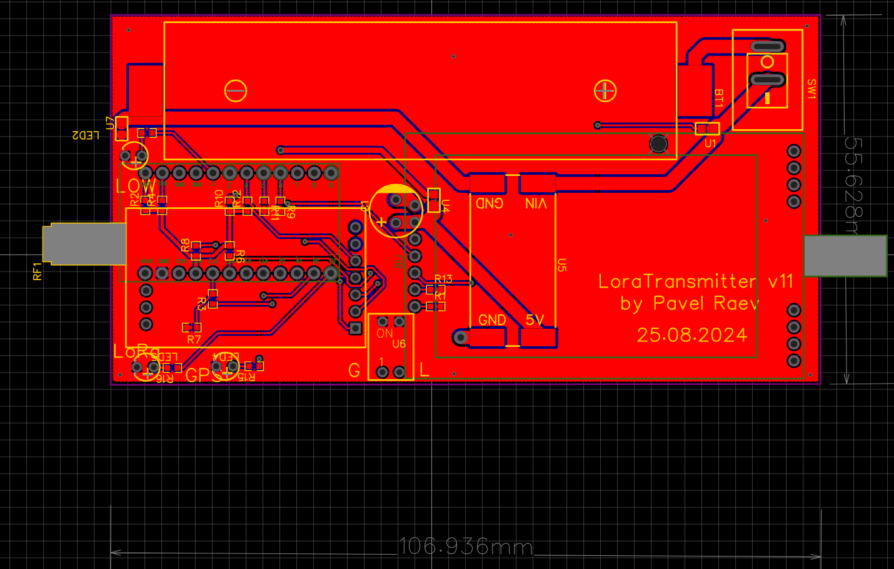

# README #

This README would normally document whatever steps are necessary to get your application up and running.

### What is this repository for? ###

* Quick summary
 Simple device to share it's coordinates over Lora
 

### How do I get set up? ###

* Compose schema
  

PCB

* Configuration
Open project in PlatformIO

* Dependencies
EByte LoRa E32 library by Renzo
TinyGPSPlus

### How do I get set up transmitter? ###

* Compose schema
  

PCB

* Configuration
  Open project in PlatformIO

* Dependencies
  EByte LoRa E32 library by Renzo
  
  
### Notes

Not all pins on the Leonardo and Micro support change interrupts, so only the following can be used for RX: 8, 9, 10, 11, 14 (MISO), 15 (SCK), 16 (MOSI).

### Tips ###
* [Learn Markdown](https://bitbucket.org/tutorials/markdowndemo)
